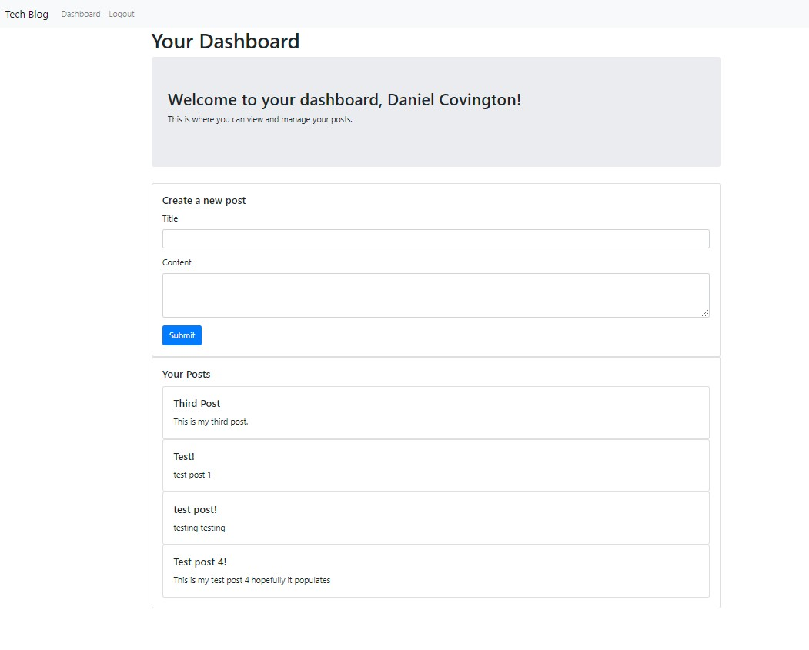

# Tech_Blog
## Description
A full stack blogging application that allows users to create an account, log in, and post their tech-related thoughts. The application is built with Node.js, Express.js, Handlebars.js, Sequelize, and MySQL, with a MVC (Model-View-Controller) structure.

## Table of Contents
- [Installation](#installation)
- [License](#license)
- [Badges](#badges)
- [Tests](#tests)
- [Questions](#questions)

## Installation
To use this project, you will need to first clone the repository. After that, install the dependencies by running the following command in the terminal:  $ npm install

After running the command, navigate to `http://localhost:3001` (or whichever port you have set in your environment) in your browser.

In the application, you can sign up for a new account or log in to an existing one. Once logged in, you can view all posts, create new posts, and logout.

## Credits

## License
MIT License

## Badges

## Tests
To run tests, you will need to write your own tests and install a testing library such as Jest. As of now, this project does not include any tests.
    

## Questions
GitHub Profile: [https://github.com/Daniel-Covington/Tech_Blog](https://github.com/Daniel-Covington/Tech_Blog) 
For further questions, you can reach me at DanielmCovington@gmail.com